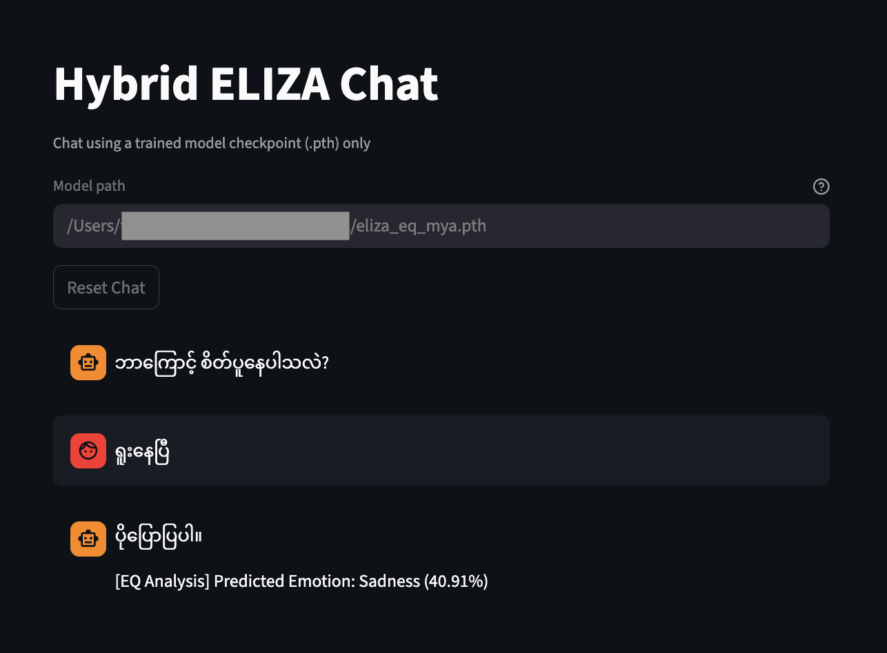

# Hybrid ELIZA Multi for Burmese and English Emotion Classification

This project builds a hybrid conversational system that combines:

- a **rule-based ELIZA-style chatbot**
- a **BiLSTM + Attention emotion classifier**

The system supports both **English** and **Myanmar (Burmese)**, with a stronger focus on Myanmar data collection, cleaning, tokenization, and final model evaluation.

---

# 1. Project Goal

The goal of this project is to:

1. collect emotion-labeled text data
2. clean and prepare the dataset
3. tokenize Myanmar text with an appropriate tokenizer
4. train a neural emotion classification model
5. integrate the model into a hybrid ELIZA-style chatbot
6. support inference and chat without retraining

The emotion classification task uses **6 classes**:

- `0 = Sadness`
- `1 = Joy`
- `2 = Love`
- `3 = Anger`
- `4 = Fear`
- `5 = Surprise`

---

# 2. Dataset Collection

## 2.1 English Data

For English, the project uses the standard `emotions.csv` format already provided for the original Hybrid ELIZA assignment.

Expected format:

```csv
text,label
i feel sad,0
i am very happy,1
````

## 2.2 Myanmar Data

For Myanmar, emotion-labeled sentences were collected manually from social-style text sources such as:

* Facebook comments
* conversational Burmese text
* emotion-rich short sentences

The dataset was manually labeled into the same 6 emotion classes.

The Myanmar dataset was stored in CSV format with:

```csv
text,label
ငါ ဝမ်းနည်း နေတယ်,0
အရမ်း ပျော် တယ်,1
```

The final working file used for model training was:

```text
final.csv
```

---

# 3. Dataset Cleaning and Preparation

Because the raw Myanmar dataset contained formatting issues, duplicate lines, quotes, punctuation inconsistencies, and blank entries, a cleaning pipeline was applied before model training.

## 3.1 Basic File Inspection

The first step was checking the raw CSV structure.

### Count total lines

```bash
wc -l emotions_mya1.csv
```

### Check malformed rows

```bash
awk -F',' 'NF != 2' emotions_mya1.csv | wc -l
grep -n '["]' emotions_mya1.csv | wc -l
```

This helped detect rows that did not match the required:

```text
text,label
```

format.

---

## 3.2 Remove Blank Sentences

Blank text entries were removed with:

```bash
awk -F',' '$1 != ""' emotions_mya1.csv > step1.csv
```

---

## 3.3 Merge Multiline Text and Clean Quotes

Some text rows contained line breaks or quote-related issues. These were converted into a single-line sentence format using Perl:

```bash
perl -CSDA -0777 -pe 's#"([^"]*)",(.*?)#do { my $t=$1; $t =~ s/\R/ /g; "$t,$2" }#ge' step1.csv > step2.csv
```

---

## 3.4 Detect and Remove Duplicates

### Check duplicate sentences

```bash
sort step2.csv | uniq -d
```

### Count duplicate frequency

```bash
sort step2.csv | uniq -c | sort -nr | head
```

### Remove duplicates

```bash
sort step2.csv | uniq > step3.csv
```

---

## 3.5 Optional Punctuation Cleaning

In some cases, punctuation such as `၊` and `။` was checked and optionally removed:

```bash
grep -n '[၊။"]' step3.csv | wc -l
sed 's/[၊။]//g' step3.csv > delete.csv
```

Quotes were also removed if any remained:

```bash
grep -n '["]' delete.csv | wc -l
sed 's/"//g' delete.csv > final.csv
```

---

## 3.6 Shuffle the Final Dataset

Since sorting during duplicate removal changed the original order, the dataset was shuffled again:

```bash
(head -n 1 final.csv && tail -n +2 final.csv | shuf) > shuffled.csv
```

---

## 3.7 Optional Manual Train/Test Split

If needed, a manual split could be done using shell commands:

```bash
head -n 1000 shuffled.csv > train.csv
tail -n +1001 shuffled.csv > test.csv
```

However, in the final Python pipeline, train/validation/test splitting was handled inside the model code.

---

# 4. Tokenization

Myanmar text does not have consistent whitespace word boundaries, so tokenization is critical.

This project supports three Myanmar tokenizer options:

* `mmdt`
* `oppaword`
* `myword`

## Final tokenizer used

The final model was trained with:

```text
oppaword
```

This was chosen because it gave a more suitable tokenization behavior for the collected Burmese emotion dataset.

Example training command:

```bash
python3 hybrid-eliza-multi-final.py \
  --mode train \
  --lang mya \
  --data final.csv \
  --tokenizer oppaword \
  --oppaword_script ./oppaWord/oppa_word.py \
  --oppaword_dict ./oppaWord/data/myg2p_mypos.dict \
  --val_split 0.1 \
  --test_split 0.1 \
  --eval_report \
  --eval_matrix
```

---

# 5. Model Architecture

The emotion classifier uses:

* **Embedding layer**
* **Bidirectional LSTM**
* **Attention layer**
* **Fully connected output layer**

This architecture takes tokenized text as input and predicts one of the 6 emotion classes.

The model is implemented in:

```text
hybrid-eliza-multi-final.py
```

---

# 6. Training Pipeline

The final version of the system uses a proper:

```text
train / validation / test
```

split.

## 6.1 Split strategy

* `train_split = 80%`
* `val_split = 10%`
* `test_split = 10%`

The model is trained on the training set, monitored on the validation set during epochs, and finally evaluated on the held-out test set.

## 6.2 Training output

During training, the script prints:

```text
Epoch X | Loss | Val Acc
```

This gives a running view of model learning and validation accuracy.

---

# 7. Final Model Evaluation

After training, the final model is evaluated on the **test set**, not just on validation data.

## Final Test Accuracy

```text
[Final Test Accuracy]: 56.48%
```

## Final Test Classification Report

```text
              precision    recall  f1-score   support

           0       0.56      0.45      0.50        20
           1       0.46      0.67      0.55        18
           2       0.80      0.67      0.73        18
           3       0.56      0.53      0.54        19
           4       0.43      0.69      0.53        13
           5       0.75      0.45      0.56        20

    accuracy                           0.56       108
   macro avg       0.59      0.58      0.57       108
weighted avg       0.60      0.56      0.57       108
```

## Interpretation

These results show that:

* the model performs substantially above random guessing for a 6-class task
* the classifier is strongest on some classes such as **Love**
* the model still shows confusion in more subtle or overlapping emotions
* the result is reasonable for:

  * a relatively small dataset
  * informal Burmese text
  * a low-resource language setting

---

# 8. Inference

The final script supports single-text inference without retraining.

## Myanmar inference

```bash
python3 hybrid-eliza-multi-final.py \
  --mode infer \
  --lang mya \
  --model_path eliza_eq_mya.pth \
  --tokenizer oppaword \
  --oppaword_script ./oppaWord/oppa_word.py \
  --oppaword_dict ./oppaWord/data/myg2p_mypos.dict \
  --infer_text "ငါ ဝမ်းနည်း နေတယ်"
```

## English inference

```bash
python3 hybrid-eliza-multi-final.py \
  --mode infer \
  --lang en \
  --model_path eliza_eq_en.pth \
  --infer_text "i feel really happy today"
```

The output includes:

* input text
* predicted emotion label
* confidence score

---

# 9. Hybrid ELIZA Chat Mode

The trained emotion model is integrated with a rule-based ELIZA chatbot.

In chat mode, the system:

1. takes user input
2. generates an ELIZA-style rule-based response
3. predicts the emotion using the trained BiLSTM model
4. displays both together

Example:

```text
You: ငါ ဝမ်းနည်း နေတယ်
ELIZA: ပိုပြောပြပါ။
[EQ Analysis]: Predicted Emotion: Sadness (82%)
```

Run chat mode with:

```bash
python3 hybrid-eliza-multi-final.py \
  --mode chat \
  --lang mya \
  --tokenizer oppaword \
  --oppaword_script ./oppaWord/oppa_word.py \
  --oppaword_dict ./oppaWord/data/myg2p_mypos.dict
```

---

# 10. Streamlit Interface

A separate `app.py` file was created to provide an interactive chat interface without retraining.

The Streamlit app:

* loads the trained `.pth` model directly
* automatically configures tokenizer paths for Myanmar
* uses the same HybridEliza class
* supports continuous chat with session memory

Run with:

```bash
streamlit run app.py
```

Then open:

```text
http://localhost:8501
```

Demo:



---

# 11. Project Files

Example structure:

```text
project/
│
├── hybrid-eliza-multi-final.py
├── app.py
├── final.csv
├── eliza_eq_mya.pth
├── emotions.csv
├── oppaWord/
└── myWord/
```

---

# 12. Summary of What Was Done

This project completed the following pipeline:

1. manually collected emotion-labeled English and Myanmar data
2. cleaned malformed CSV rows, blank entries, duplicates, quotes, and punctuation issues
3. selected an appropriate tokenizer for Myanmar text
4. trained a BiLSTM + Attention emotion classifier
5. evaluated the model using train / validation / test split
6. obtained a final test accuracy of **56.48%**
7. integrated the classifier into a Hybrid ELIZA chatbot
8. built inference and chat interfaces, including a Streamlit app

---

# 13. Notes

* Stopwords were not removed because they may carry emotional meaning
* Spelling variation was not aggressively normalized to preserve natural text patterns
* Tokenizer choice must match training and inference
* Current performance is a baseline result and can be improved with more data and better normalization

