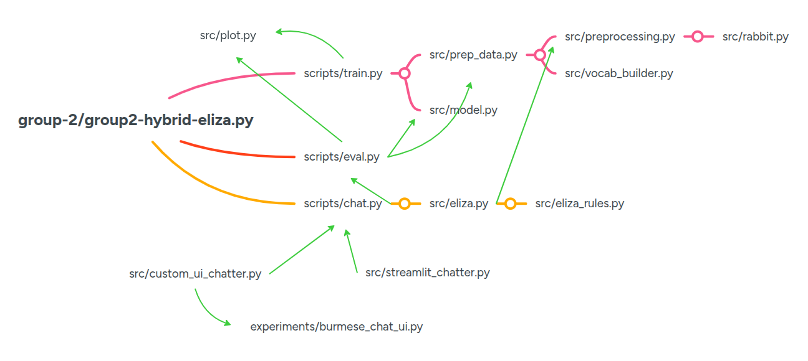

# Group 2 Assignment Submission

## Dataset

Our custom dataset comprises Facebook comments, synthetic data generated via generative models, and manually authored entries. It is categorized into the following six emotional classes:
- 0: ဝမ်းနည်းမှု (sadness)
- 1: ပျော်ရွှင်မှု (joy)
- 2: ချစ်ခင်မှု (love)
- 3: ဒေါသ (anger)
- 4: ကြောက်ရွံ့မှု (fear)
- 5: အံ့အားသင့်မှု (surprise)

---

## Project Structure

Run all CLI examples from the `group-2/` directory (repository root for this submission).

```
group-2/
├── group2-hybrid-eliza.py      # main CLI: --mode train | eval | chat
├── pyproject.toml
├── requirements.txt
├── .python-version
├── data/
│   ├── raw_ungrouped/          # original team files (not merged)
│   ├── annotated_ungrouped/    # cleaned/labeled team files (not merged)
│   ├── merged/                 # combined sheets
│   ├── merged_preprocessed/    # combined sheets before/after downsampling
│   └── stopwords.txt           # Burmese stopword list (see References)
├── checkpoints/                # saved `.pth` bundles (weights + vocab + label maps)
├── notebooks/                  # EDA and demos (e.g. Data Preprocessing, Model Training Demo)
├── scripts/
│   ├── train.py
│   ├── eval.py
│   ├── chat.py                 # shared chat logic; loads src/model.py + src/eliza.py
│   ├── streamlit_chatter.py    # Streamlit UI (subprocess from chat.py)
│   └── custom_ui_chatter.py    # browser UI (subprocess from chat.py + UI from experiments/burmese_chat_ui.py)
├── experiments/                # early standalone hybrids, guides, logs, burmese_chat_ui.py
└── src/
    ├── preprocessing.py        # emotion pipeline: normalize, MMDT, stopwords, optional char n-grams
    ├── rabbit.py               # Zawgyi to Unicode
    ├── vocab_builder.py
    ├── prep_data.py            # shared tensors/loaders for train / eval / chat encoding
    ├── eliza_rules.py
    ├── eliza.py                # rule engine (separate tokenization from emotion model)
    ├── model.py                # BiLSTM + attention classifier
    └── plot.py                 # optional confusion matrix PNG (eval / train)
```

The following diagram summarizes the key components of our modular approach.

<!-- Architecture Overview Diagram -->
<p align="center">
  
</p>

---

## Project Flow

The code is organized so a single wrapper script controls the high-level mode, while `src/` contains reusable building blocks.

- `group2-hybrid-eliza.py` (primary entry point): the top-level CLI wrapper/dispatcher. It selects one of the modes and starts the corresponding script in `scripts/`.

- `scripts/train.py`: training orchestration. It uses `src/prep_data.py` and `src/model.py`, and writes a checkpoint that bundles the trained weights with the same vocabulary and label setup used for later runs.

- `scripts/eval.py`: evaluation on a labeled dataset. It loads a checkpoint from training, uses `src/prep_data.py` and `src/model.py` with that checkpoint, and reports how well the saved setup predicts labels.

- `scripts/chat.py`: interactive inference. It follows the same emotion path as `scripts/eval.py`, and pairs that with dialogue from `src/eliza.py`.

- `src/eliza_rules.py`: rule data only, paired with `src/eliza.py`.

- `src/eliza.py`: ELIZA dialogue behavior; it consumes `src/eliza_rules.py`. Rule matching uses `tokenize_for_rules` (no char n-grams); the emotion model uses `src/preprocessing.py` separately.

- `src/prep_data.py`: shared data preparation for training and inference. It sits between the datasets/checkpoints and the emotion pipeline, and depends on `src/preprocessing.py` plus `src/vocab_builder.py`.

- `src/preprocessing.py`: preprocessing for the **emotion model**. It depends on `src/rabbit.py` for script conversion and on external Myanmar tokenization libraries as noted under References.

- `src/vocab_builder.py`: builds the vocabulary and fixed label order for the six emotion classes; used from `src/prep_data.py`.

- `src/model.py`: defines the neural emotion classifier; used from `scripts/train.py` and `scripts/eval.py`.

- `src/plot.py`: saves a confusion matrix figure; used from `scripts/train.py` and `scripts/eval.py` optionally.

- `src/rabbit.py`: Zawgyi-to-Unicode conversion support; used from `src/preprocessing.py`.

In short: `group2-hybrid-eliza.py` starts the run; `scripts/*.py` control train/eval/chat; `src/*.py` implements the reusable preprocessing/model utilities.

---

## CLI Guide for `group2-hybrid-eliza.py`

Run from `group-2/`.

Modes: `--mode train`, `--mode eval`, `--mode chat`.

Important flags (not exhaustive):
- `--data_path`,
- `--checkpoint_path` (read/write for train; read for eval/chat),
- `--stopwords_path`,
- `--epochs`,
- `--batch_size`,
- `--lr`,
- `--embed_dim`,
- `--hidden_dim`,
- `--use_attention` / `--no-use_attention`,
- `--use_char_ngrams` / `--no-use_char_ngrams`,
- `--confusion_matrix_out`,
- `--chat_ui`, `--language`, `--custom_ui_host`, `--custom_ui_port`.

Defaults: training reads `./data/merged_preprocessed/data_after_downsampling.csv` and saves to `./checkpoints/bilstm_larger_params_after_downsampl.pth`. Train/eval also write a confusion matrix PNG under `./img/` unless disabled.

---

### Training Examples

**1. Default**
```bash
python group2-hybrid-eliza.py --mode train
```

**2. Custom model shape & checkpoint name**
```bash
python group2-hybrid-eliza.py --mode train --embed_dim 512 --hidden_dim 256 --checkpoint_path ./checkpoints/bilstm_larger_params.pth
```

**3. Further customizations**  
```bash
python group2-hybrid-eliza.py --mode train --data_path ./data/merged/Combined.csv --embed_dim 128 --hidden_dim 96 --checkpoint_path ./checkpoints/bilstm_smaller_params_after_downsampl.pth
```
or
```bash
python group2-hybrid-eliza.py --mode train --data_path ./data/merged/Combined.csv --embed_dim 512 --hidden_dim 256 --checkpoint_path ./checkpoints/bilstm_larger_params.pth
```

---

### Evaluation Example

Uses the same `--data_path` and `--checkpoint_path` as training for a fair comparison.

```bash
python group2-hybrid-eliza.py --mode eval --data_path ./data/merged_preprocessed/data_after_downsampling.csv --checkpoint_path ./checkpoints/bilstm_larger_params_after_downsampl.pth
```

---

### Chat Example

All use the same `scripts/chat.py` logic; only the front end changes. Override the model with `--checkpoint_path` (and `--stopwords_path` if needed).

**Terminal (stdin/stdout)**

```bash
python group2-hybrid-eliza.py --mode chat --chat_ui terminal
```

**Streamlit**

```bash
python group2-hybrid-eliza.py --mode chat --chat_ui streamlit
```

**Custom browser UI**

```bash
python group2-hybrid-eliza.py --mode chat --chat_ui custom_ui
```

Optional: `--language en` or `--language mm`, `--custom_ui_host`, `--custom_ui_port`.

---

## References

- Unicode Myanmar script blocks:
    - https://www.unicode.org/charts/PDF/U1000.pdf
    - https://www.unicode.org/charts/PDF/UAA60.pdf
- Burmese grammar: https://online.fliphtml5.com/rrlzh/mbir/#p=1
- Rabbit Zawgyi to Unicode Converter: https://github.com/Rabbit-Converter/Rabbit-Python 
- MMDT Tokenizer: https://github.com/Myanmar-Data-Tech/mmdt-tokenizer
