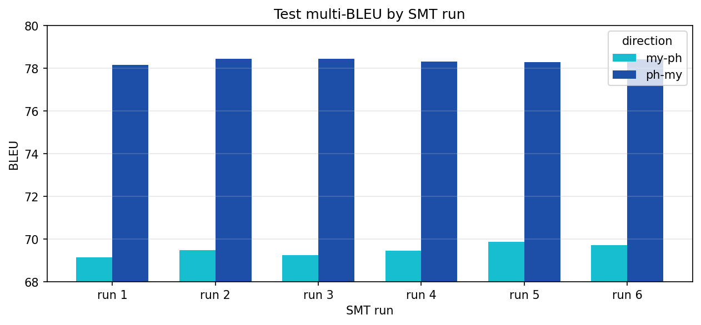
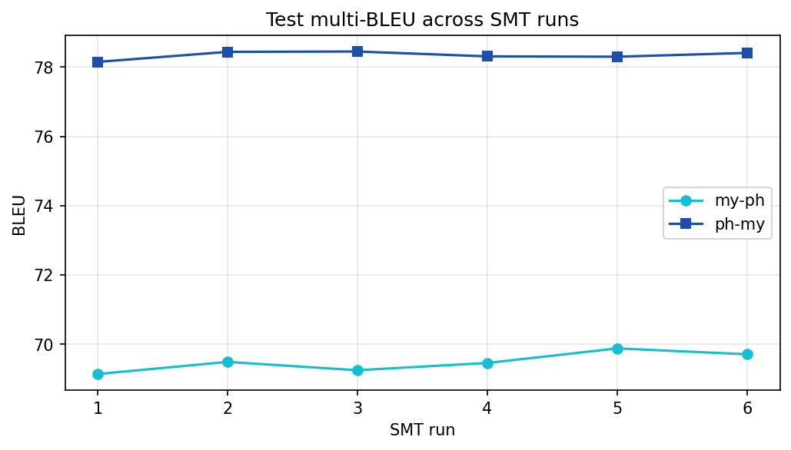

# Basic Statistical Machine Translation

## Overview

This project implements a basic SMT system for Burmese grapheme-to-phoneme (G2P) translation using established SMT toolkits such as Moses, GIZA++, and MGIZA, along with custom preprocessing scripts for data normalization and preparation.

The workflow covers the full SMT pipeline from data normalization and SGM file generation to training, decoding, and evaluation. Multiple experiments are documented with varying settings. BLEU scores and translation outputs are systematically logged and summarized for comparative analysis.

## Error-Free PBSMT Workflow

- Use Ubuntu-native Perl v5.38
- Install Moses, GIZA++, and MGIZA
- Optionally configure paths in 
    - config.baseline, generate_configs.pl,
    - generate_sgms.pl, src2sgm.pl, and ref2sgm.pl
- Create config.baseline for two translation directions using `generate_configs.pl`
- Create SGMs using `generate_sgms.pl`
- Copy the `mkcls` file from the `giza-pp/mkcls-v2/` folder to the `giza-pp/GIZA++-v2/` folder
- Install ImageMagick and Graphviz using sudo
- Edit `ubuntu-17.04/moses/scripts/generic/mteval-v13a.pl`:
    ```perl
    line 950: \p{Line_Break} # replace this
    line 950: \p{Line_Break=Hyphen} # with this
    ```

## Experiments

1. **SMT run1** (run1,2,3 in [pbsmt_v1](notebooks/pbsmt_v1.ipynb) and [pbsmt_v2](notebooks/pbsmt_v2.ipynb) => baseline/run 1+2+3): syl-normalization, 5-gram, max-phrase 5, prune 001, GIZA
2. **SMT run2** (run4 in [pbsmt_v3](notebooks/pbsmt_v3.ipynb) => baseline2/run 1): new syl-normalization, 5-gram, max-phrase 5, prune 001, GIZA
3. **SMT run3** (run5 in [pbsmt_v3](notebooks/pbsmt_v3.ipynb) => baseline2/run 2): new syl-normalization, 3-gram, max-phrase 5, prune 001, GIZA
4. **SMT run4** (run6 in [pbsmt_v4](notebooks/pbsmt_v4.ipynb) => baseline2/run 3): new syl-normalization, 3-gram, max-phrase 3, prune 001, GIZA
5. **SMT run5** (run7 in [pbsmt_v4](notebooks/pbsmt_v4.ipynb) => baseline2/run 4): new syl-normalization, 3-gram, max-phrase 3, prune 000, GIZA
6. **SMT run6** (run8 in [pbsmt_v4](notebooks/pbsmt_v4.ipynb) => baseline2/run 5): new syl-normalization, 3-gram, max-phrase 3, prune 001, MGIZA

Summary: [presentation slides](presentation_slides.pdf)

Results:
|  |  |
|------------------------|-------------------------|

## Dataset

- [Sayar's G2P dataset](https://github.com/ye-kyaw-thu/AIE-F/tree/main/slide-code/class-13and14/data)

## File Structure
```
/
...
├── img/
├── notebooks/
├── summary/
│
├── baseline/           # run1 to run3 with data v1
│   ├── logs/
│   ├── my-ph/
│   │   ├── corpus/
│   │   ├── evaluation/
│   │   ├── lm/
│   │   ├── model/
│   │   ├── steps/
│   │   ├── training/
│   │   └── tuning/
│   └── ph-my/
│       └── ...
├── baseline2/          # run4 to run6 with data v2
│   └── ...
│
├── data/
│   ├── g2p-par/                    # originally Sayar's
│   ├── cleaned/                    # preprocessed data (version 1)
│   │   ├── ...
│   │   └── test-sgm/
│   │       ├── generate_sgms.pl    # originally Sayar's
│   │       ├── src2sgm.pl          # originally Sayar's
│   │       └── ref2sgm.pl          # originally Sayar's
│   ├── cleaned_2/                  # preprocessed data (version 2)
│   │   └── ...
│   └── logs/
│
├── syl-normalizer/     # originally Sayar's # modified to merge with previous token for athat (်) cases
│
├── config.baseline     # originally Sayar's # modified paths # uncomment multi-bleu
├── generate_configs.pl # originally Sayar's # modified paths
└── run-baseline.pl     # originally Sayar's # modified paths
```

## References

- [Moses SMT Framework](https://www.statmt.org/moses-release/RELEASE-4.0/binaries/)
- [GIZA](https://github.com/moses-smt/giza-pp)
- [MGIZA](https://github.com/moses-smt/mgiza)
- [In-Class Tutorial](https://github.com/ye-kyaw-thu/AIE-F/tree/main/slide-code/class-13and14/SMT_Tutorial)
- [PBSMT Example](https://github.com/ye-kyaw-thu/MTRSS/tree/master/pbsmt)

## Note

This project was done for educational purposes as an assignment for the AI Engineering Fundamentals class taught by [*Sayar Ye Kyaw Thu*](https://github.com/ye-kyaw-thu).