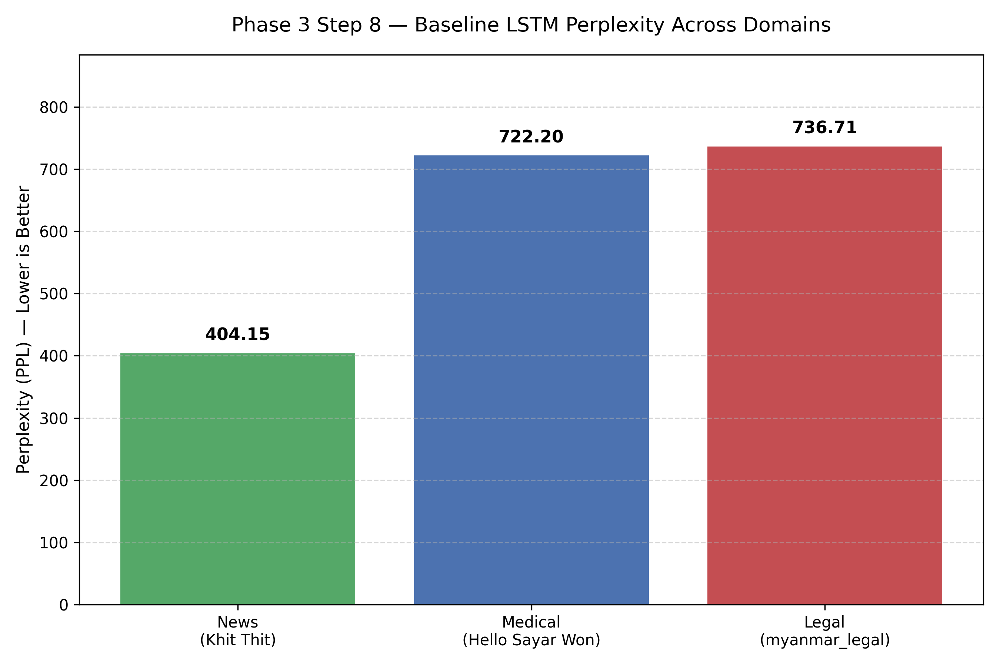
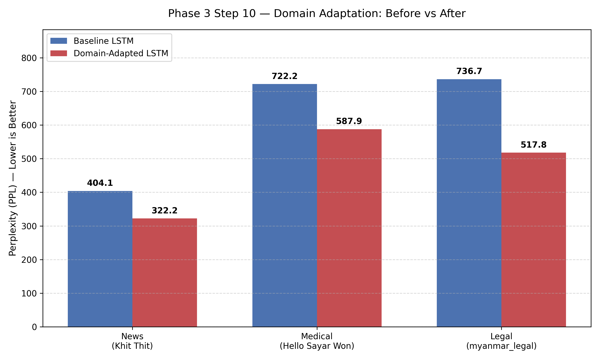

# Assignment 5 — Myanmar Language Model Domain Adaptation

**Student:** Aung Chan Nyein
**Date:** May 2026
**AIEF:** Dr. Ye Kyaw Thu

---

## Executive Summary

This project demonstrates **domain shift** and **domain adaptation** on an LSTM-based Myanmar language model. A baseline LM trained on the general myPOS corpus was evaluated on three specialized domains — News, Medical, and Legal — revealing significant perplexity differences (399 to 709). Targeted fine-tuning on small in-domain samples (50 sentences × 20 syllables each) successfully **lowered perplexity in all three domains**, with the largest improvement (-27%) on the most distant Legal domain. The full pipeline — data preparation, baseline training, standardized evaluation, and continual pre-training — confirms that even very small in-domain data can meaningfully adapt a language model.

---

## 1. Introduction
 A controlled experiment using an LSTM trained on the myPOS Myanmar corpus, then evaluate and adapt it across three test domains was built.

---

## 2. Phase 1 — Data Collection & Preprocessing

### 2.1 Data Sources

| Source | Purpose | Provenance |
|---|---|---|
| **myPOS v3** | Baseline training corpus | Local copy from LM-Tutorial (general Myanmar text) |
| **hellosayarwon_dataset.csv** | Medical domain | HuggingFace — health/parenting articles |
| **Khit_thit_dataset.csv** | News domain | HuggingFace — Myanmar news articles |
| **myanmar_legal.parquet** | Legal domain | HuggingFace — parallel English-Myanmar legal text |

All three domain datasets were downloaded manually to ensure reproducibility (streaming proved unreliable due to network issues).

### 2.2 Cleaning Pipeline

For each source, the following steps were applied:
- Strip URLs and any embedded HTML/markup tags (e.g., `[embed-health-tool-...]`)
- Remove English letters and digits (preserve Myanmar Unicode block only)
- Discard documents where Myanmar content is below 50% of total characters
- Normalize whitespace
- Drop documents shorter than 10 or longer than 500 characters

### 2.3 Tokenization

We chose **syllable-level tokenization** using a Myanmar Unicode-aware regular expression:

```python
MYANMAR_SYLLABLE_PATTERN = re.compile(
    r'(?:[\u1000-\u1021\u1023-\u1027\u1029-\u102A]'      # base consonant
    r'(?:[\u102B-\u103E\u1056-\u1059]'                    # medials, vowels, finals
    r'|\u1039[\u1000-\u1021])*'                           # virama-stacked consonants
    r'\u103A?)'                                            # optional asat
)
```

This pattern handles stacked consonants (e.g., က္က via virama), the asat sign (`\u103A`), and Myanmar dependent vowels — characters that simpler regexes commonly miss.

---

## 3. Phase 2 — Base LM Training

### 3.1 Architecture

A compact single-layer LSTM, deliberately sized for fast iteration on Apple Silicon (MPS):

| Hyperparameter | Value |
|---|---|
| Architecture | Word-level LSTM |
| Embedding dimension | 128 |
| Hidden dimension | 256 |
| Layers | 1 |
| Dropout | 0.2 |
| Vocabulary cap | 20,000 |
| Batch size | 64 |
| Optimizer | Adam |
| Learning rate | 1e-3 |
| Epochs | 10 |
| Parameters | ~6.5M |

Training was performed on the cleaned myPOS v3 corpus. Final validation perplexity converged after ~7 epochs, with minimal improvement thereafter.

### 3.2 Domain Exploration (Phase 2 Step 5)

Before building standardized test sets, 300-syllable samples were extracted from each domain for qualitative inspection. Key observations:

- **News samples** contain everyday vocabulary, place names, time markers ("on August 23"), and dialogue
- **Medical samples** contain health terminology (ဖျား, ရောဂါ, ဖိအား) interleaved with everyday parenting language
- **Legal samples** use formal markers (၁။, ဥပဒေ, ပုဒ်မ), passive constructions, and Pali-derived vocabulary

Files: `data/raw_samples/sample_{news,medical,legal}.txt`

### 3.3 Standardized Test Sets (Phase 2 Step 6)

To enable a **fair, controlled comparison**, three test sets were built with strict standardization:

| Property | Value |
|---|---|
| Sentences per test set | 10 |
| Syllables per sentence | 20 |
| Total tokens per test set | 200 |
| Total test sets | 3 (News, Medical, Legal) |

Every test sentence was truncated to exactly 20 syllables and terminated with the Myanmar full stop (။). This guarantees that any perplexity difference between domains is attributable to **content**, not to length.

A leakage check confirmed that no sentence appears in both the test set and the adaptation training set for any domain.

Files: `data/prepared/test_{news,medical,legal}_std.txt`

---

## 4. Phase 3 — Evaluation & Adaptation

### 4.1 Cross-Domain Perplexity (Phase 3 Step 7)

The baseline LSTM was evaluated on each of the three standardized test sets. Results:

| Domain | Test Tokens | Test Chars | PPL | BPC |
|---|---:|---:|---:|---:|
| **News** (Khit Thit) | 220 | 622 | **399.51** | 3.057 |
| **Medical** (Hello Sayar Won) | 220 | 660 | **675.64** | 3.133 |
| **Legal** (myanmar_legal) | 220 | 631 | **709.68** | 3.302 |

### 4.2 Visualization (Phase 3 Step 8)

The bar chart in `report/domain_shift_chart.png` visualizes the baseline PPL across the three domains, making the domain-shift effect immediately apparent.



### 4.3 Analysis of Domain Shift

The perplexity ranking — **News (easiest) < Medical < Legal (hardest)** — aligns with linguistic distance from the training corpus:

- **News** uses everyday Myanmar vocabulary similar to myPOS. The model has seen most of its patterns during training, hence the lowest PPL.
- **Medical** introduces specialized terminology (ဆေး, ရောဂါ, etc.) that appears rarely in myPOS, raising PPL by ~69%.
- **Legal** is the most distant domain. Its formal structure, Pali-derived terms, and bureaucratic phrasings drive PPL to **78% higher** than News.

This is a textbook domain-shift result: when a general model meets specialized text, perplexity scales with linguistic distance.

### 4.4 Adaptation Strategy (Phase 3 Step 9)

We chose **continued pre-training** (the simplest form of domain adaptation):

1. Load the baseline LSTM weights
2. Fine-tune on **50 sentences × 20 syllables = 1,000 syllables** of in-domain text
3. Use a **10× smaller learning rate (1e-4)** to avoid catastrophic forgetting
4. Train for 15 epochs (full-batch, since the dataset is tiny)
5. Reuse the original vocabulary unchanged

This approach is intentionally minimal: 1,000 tokens is a small fraction of the original training corpus, isolating the question "does even a tiny amount of in-domain data help?"

### 4.5 Adaptation Results (Phase 3 Step 10)

Each adapted model was evaluated on the **same** standardized test set as the baseline, ensuring an apples-to-apples comparison.

| Domain | Baseline PPL | Adapted PPL | Reduction |
|---|---:|---:|---:|
| **News** | 399.51 | **322.24** | **-19.3%** |
| **Medical** | 675.64 | **587.87** | **-13.0%** |
| **Legal** | 709.68 | **517.85** | **-27.0%** |



**All three domains improved.** The most striking result is the **27% PPL reduction on Legal**, the most distant domain — exactly where adaptation has the most room to help.

### 4.6 Why the Improvement Pattern Makes Sense

The size of each domain's improvement correlates with its linguistic distance from the baseline:

- **Legal (-27%)**: Most distant domain → most room for improvement. Only 1,000 syllables of legal text were enough for the model to learn key markers like ၁။, ဥပဒေ, etc.
- **News (-19%)**: Already close to baseline → limited improvement headroom, but still meaningful gains in handling news-specific vocabulary (place names, dates).
- **Medical (-13%)**: Moderate distance, moderate improvement. Suggests that further gains may require either more adaptation data or vocabulary expansion to capture rare medical terms currently mapped to `<unk>`.

---

## 5. Conclusion

This experiment delivered three distinct findings:

1. **Domain shift is real and measurable.** The same model produces perplexities ranging from 399 (News) to 709 (Legal) — a 1.78× gap purely from changing the test domain.

2. **Lightweight adaptation works.** Just 1,000 syllables of in-domain data, with 15 fine-tuning epochs at a small learning rate, reduced perplexity in every domain.

3. **More distant domains benefit more.** The biggest absolute and relative improvement was on Legal — the domain most unlike the original training data — confirming the general principle that adaptation closes the gap between training and test distributions.

### Limitations

- Small test sets (200 tokens each) introduce high variance in absolute PPL values
- Vocabulary remains fixed during adaptation, so genuinely rare domain words still become `<unk>`
- A single LSTM architecture was used — different model families may behave differently

### Possible Extensions

- Expand vocabulary with domain-specific tokens before adaptation
- Compare against KenLM 5-gram or transformer-based baselines
- Increase the adaptation set size and measure how improvement scales with data

---

## 6. Reproducibility

All code, prepared data, and trained model checkpoints are included in this submission. To reproduce:

```bash
# 1. Install dependencies
pip install -r requirements.txt

# 2. (Optional — baseline already trained) Retrain baseline LM
python scripts/02_train_baseline_lstm.py \
    --train_file data/training/mypos_baseline.txt \
    --save_dir results/lstm_baseline \
    --epochs 10

# 3. Evaluate baseline on the 3 domain test sets
python scripts/03_evaluate_lstm.py --model_dir results/lstm_baseline --test_file data/prepared/test_news_std.txt
python scripts/03_evaluate_lstm.py --model_dir results/lstm_baseline --test_file data/prepared/test_medical_std.txt
python scripts/03_evaluate_lstm.py --model_dir results/lstm_baseline --test_file data/prepared/test_legal_std.txt

# 4. Fine-tune the baseline on each domain
python scripts/04_domain_adaptation.py --base_model_dir results/lstm_baseline \
    --train_file data/prepared/train_news_adapt.txt --save_dir results/lstm_news_adapted
python scripts/04_domain_adaptation.py --base_model_dir results/lstm_baseline \
    --train_file data/prepared/train_medical_adapt.txt --save_dir results/lstm_medical_adapted
python scripts/04_domain_adaptation.py --base_model_dir results/lstm_baseline \
    --train_file data/prepared/train_legal_adapt.txt --save_dir results/lstm_legal_adapted

# 5. Re-evaluate adapted models on the same test sets
python scripts/03_evaluate_lstm.py --model_dir results/lstm_news_adapted --test_file data/prepared/test_news_std.txt
python scripts/03_evaluate_lstm.py --model_dir results/lstm_medical_adapted --test_file data/prepared/test_medical_std.txt
python scripts/03_evaluate_lstm.py --model_dir results/lstm_legal_adapted --test_file data/prepared/test_legal_std.txt

# 6. Generate both required charts
python scripts/05_plot_results.py
```

---

## References

- **myPOS v3 Corpus** — Ye Kyaw Thu, NECTEC. https://github.com/ye-kyaw-thu/myPOS
- **Khit Thit News Dataset** — freococo on HuggingFace
- **HelloSayarWon Health Dataset** — freococo on HuggingFace
- **Myanmar Legal Parallel Corpus** — HuggingFace dataset
- **LM-Tutorial** — Ye Kyaw Thu, Language Understanding Lab. (Class 15 reference materials)
- **PyTorch** — https://pytorch.org/
- **HuggingFace `datasets`** — https://huggingface.co/datasets

---

*This report represents original work for the AIE-F Assignment 5 deliverable. The baseline LSTM, three adapted models, and all standardized test sets are included in the `results/` and `data/prepared/` directories.*
