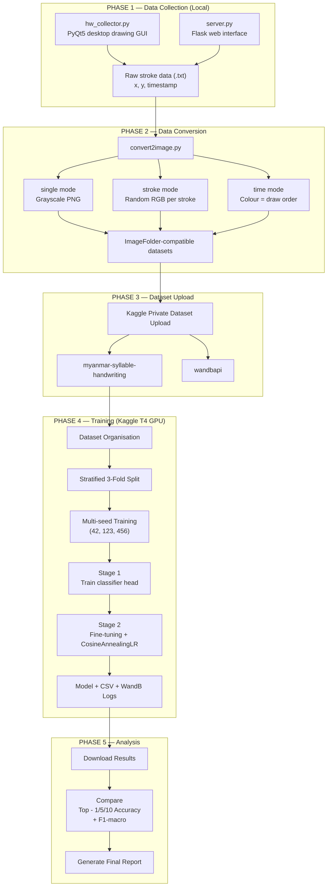

# Myanmar Syllable Handwriting Classification — Project Report

**Student:** Thein Kyaw Lwin  
**Date:** May 11, 2026
**mm-hw-collector:** Developed by Dr. Ye Kyaw Thu  
**Mobile-friendly Web:** Enhanced by Sai Zay Lin Htet and La Wun Nannda

---

## 1. Project Overview

This project investigates **few-shot, 1,000-class handwriting recognition** for Myanmar syllables. A custom desktop/web data-collection tool was built to gather on-canvas stroke data from writers, which was then converted into three distinct image representations. Multiple CNN architectures were trained and evaluated on Kaggle T4 GPUs using rigorous 3-fold × 3-seed cross-validation, producing 9 runs per experiment and 45 total training runs across five experiments.

**Key research questions:**
1. Which image colour-encoding of raw stroke data best supports classification?
2. Can a lightweight mobile network (ShuffleNetV2) classify 1,000 Myanmar syllables from only 3 samples per class?
3. How much does upgrading to ConvNeXt Tiny improve accuracy?

---

## 2. End-to-End Workflow


---

## 3. Dataset

| Property | Value |
|---|---|
| Language | Myanmar (Burmese) |
| Task | 1,000-class syllable recognition |
| Total images | 3,000 (3 samples × 1,000 classes) |
| Image size | 128 × 128 px (native resolution — no upscaling) |
| Colour modes | `single`, `stroke`, `time` |
| Train/Val split | 3-Fold Stratified CV → 2,000 train / 1,000 val per fold |
| Collection tool | Custom PyQt5 GUI (`hw_collector.py`) |
| Hosted on | Kaggle Private Dataset: `theinkyawlwin/myanmar-syllable-handwriting` |

### 3.1 Colour Mode Descriptions

| Mode | Description | Semantic information encoded |
|---|---|---|
| `single` | Black ink on white background (grayscale) | Shape only |
| `stroke` | Each stroke rendered in a random RGB colour | Stroke segmentation |
| `time` | Stroke colour = draw order gradient (red→blue) | Stroke order / writing dynamics |

**Time-mode colour encoding formula** (from `convert2image.py`):
```
R = 255 × (i / n),   G = 0,   B = 255 × (1 − i/n)
```
where `i` = stroke index, `n` = total strokes. First stroke is pure red, last is pure blue.

---

## 4. Technology Stack

| Layer | Tool / Library | Version / Notes |
|---|---|---|
| **Data Collection** | PyQt5 | Desktop canvas GUI |
| **Data Collection (web)** | Flask + Flask-CORS | Alternative web interface |
| **Image Conversion** | Pillow (PIL) | stroke→PNG rendering |
| **Dataset Hosting** | Kaggle Datasets | `theinkyawlwin/myanmar-syllable-handwriting` |
| **Training Platform** | Kaggle Kernels | NVIDIA Tesla T4 GPU |
| **Deep Learning** | PyTorch + torchvision | ImageNet pretrained weights |
| **Experiment Logging** | Weights & Biases (WandB) | Per-run metric streaming |
| **CV / Metrics** | scikit-learn | StratifiedKFold, F1, Top-k accuracy |
| **Data Handling** | NumPy, Pandas | Array ops, CSV results |
| **Reproducibility** | Python seeds + `torch.Generator` | Seeds: 42, 123, 456 |
| **Model Push** | Kaggle CLI (`kaggle kernels push`) | Via `kernel-metadata.json` |

---

## 5. Model Architectures

### 5.1 ShuffleNetV2 x1.0

- **Pretrained weights:** `IMAGENET1K_V1` (torchvision)
- **Parameters:** ~2.3M
- **Modification:** Replace final `fc` layer → `nn.Linear(1024, 1000)`
- **Design rationale:** Efficient depthwise separable convolutions; works well at 128×128 without upscaling to 224

```
Input (128×128×3)
  → ShuffleNetV2 backbone (frozen in Stage 1)
  → Global Average Pool
  → fc: Linear(1024 → 1000)
  → Softmax (1000 Myanmar syllable classes)
```

### 5.2 ConvNeXt Tiny

- **Pretrained weights:** `IMAGENET1K_V1` (torchvision)
- **Parameters:** ~28.6M
- **Modification:** Replace `classifier[2]` → `nn.Linear(768, 1000)`
- **Design rationale:** Modern CNN with depthwise convolutions, LayerNorm, GELU — superior feature extraction vs ShuffleNetV2

```
Input (128×128×3)
  → ConvNeXt Tiny backbone (4 stages, depthwise conv)
  → Global Average Pool
  → LayerNorm
  → classifier[2]: Linear(768 → 1000)
  → Softmax (1000 Myanmar syllable classes)
```

---

## 6. Training Configuration

### 6.1 Cross-Validation Strategy

All experiments use **3-Fold Stratified Cross-Validation × 3 random seeds = 9 runs**.

3-fold was chosen because exactly 3 samples per class → each fold uses 2 samples for training and 1 for validation. So, it can grantee every class appears in every validation fold.

| Parameter | Value |
|---|---|
| Folds | 3 |
| Fold seed | 42 |
| Training seeds | [42, 123, 456] |
| Total runs per experiment | 9 |

### 6.2 Data Augmentation

| Transform | Parameters | Rationale |
|---|---|---|
| RandomAffine | degrees=10, translate=0.05, scale=(0.9,1.1) | Natural writing variation |
| RandomPerspective | distortion=0.08, p=0.3 | Viewing angle variation |
| Pixel inversion | `1.0 − x` | Match ImageNet feature distribution |
| No HorizontalFlip | — | Myanmar script is not symmetric |
| No ColorJitter | — | Destroys semantic colour information |

### 6.3 Hyperparameters Per Experiment

| Parameter | ShuffleNet Single/Stroke | ShuffleNet Time (baseline) | ShuffleNet Time (tuned) | ConvNeXt Tiny Time |
|---|---|---|---|---|
| Image size | 128×128 | 128×128 | 128×128 | 128×128 |
| Batch size | 64 | 64 | 64 | 64 |
| Stage 1 LR | 1e-3 | 1e-3 | 1e-3 | 1e-3 |
| Stage 1 epochs | 6 | 6 | 6 | 6 |
| Stage 2 LR (backbone) | 5e-6 | 5e-6 | **1e-5** | **1e-5** |
| Stage 2 LR (head) | 2e-5 | 2e-5 | **5e-5** | **5e-5** |
| Stage 2 max epochs | 50 | 50 | **80** | **80** |
| Early stopping patience | 12 | 12 | **15** | **15** |
| Weight decay | 1e-4 | 1e-4 | 1e-4 | 1e-4 |
| Label smoothing | 0.1 | 0.1 | 0.1 | 0.1 |
| LR scheduler | CosineAnnealing | CosineAnnealing | CosineAnnealing | CosineAnnealing |
| Optimizer | AdamW | AdamW | AdamW | AdamW |

**Bold** = values changed from baseline. The time-tuned experiments use higher LRs because the time-mode colour gradients require the backbone to learn domain-specific colour features not present in ImageNet.

### 6.4 Two-Stage Fine-Tuning Protocol

```
Stage 1 (Head Warmup):
  - Freeze backbone (requires_grad = False)
  - Train only the new classification head
  - Rationale: prevents noisy head from corrupting pretrained backbone

Stage 2 (Full Fine-Tuning):
  - Unfreeze all parameters
  - Discriminative LR: backbone_lr << head_lr
  - CosineAnnealingLR decay to eta_min=1e-7
  - EarlyStopping on val_top5_acc (more stable than loss with 1 val sample/class)
  - Best model state restored on stop
```

---

## 7. Results

### 7.1 Per-Run Results

#### ShuffleNetV2 — Single Mode
| Fold | Seed | Val Loss | Top-1 | Top-5 | Top-10 | F1-macro |
|------|------|----------|-------|-------|--------|----------|
| 1 | 42 | 6.5192 | 0.119 | 0.319 | 0.424 | 0.0775 |
| 1 | 123 | 6.5161 | 0.121 | 0.319 | 0.440 | 0.0783 |
| 1 | 456 | 6.5278 | 0.127 | 0.329 | 0.447 | 0.0827 |
| 2 | 42 | 6.5219 | 0.113 | 0.307 | 0.416 | 0.0676 |
| 2 | 123 | 6.5167 | 0.127 | 0.319 | 0.426 | 0.0777 |
| 2 | 456 | 6.5272 | 0.127 | 0.329 | 0.431 | 0.0759 |
| 3 | 42 | 6.5242 | 0.117 | 0.308 | 0.436 | 0.0721 |
| 3 | 123 | 6.5200 | 0.129 | 0.348 | 0.456 | 0.0875 |
| 3 | 456 | 6.5195 | 0.117 | 0.355 | 0.480 | 0.0740 |

#### ShuffleNetV2 — Stroke Mode
| Fold | Seed | Val Loss | Top-1 | Top-5 | Top-10 | F1-macro |
|------|------|----------|-------|-------|--------|----------|
| 1 | 42 | 6.6161 | 0.054 | 0.143 | 0.188 | 0.0361 |
| 1 | 123 | 6.6011 | 0.044 | 0.138 | 0.215 | 0.0232 |
| 1 | 456 | 6.6143 | 0.044 | 0.151 | 0.212 | 0.0247 |
| 2 | 42 | 6.6222 | 0.054 | 0.138 | 0.195 | 0.0280 |
| 2 | 123 | 6.6229 | 0.043 | 0.141 | 0.211 | 0.0188 |
| 2 | 456 | 6.6212 | 0.035 | 0.143 | 0.209 | 0.0164 |
| 3 | 42 | 6.6208 | 0.043 | 0.142 | 0.218 | 0.0292 |
| 3 | 123 | 6.6196 | 0.048 | 0.149 | 0.220 | 0.0274 |
| 3 | 456 | 6.6268 | 0.044 | 0.144 | 0.210 | 0.0268 |

#### ShuffleNetV2 — Time Mode (Baseline)
| Fold | Seed | Val Loss | Top-1 | Top-5 | Top-10 | F1-macro |
|------|------|----------|-------|-------|--------|----------|
| 1 | 42 | 6.4865 | 0.147 | 0.360 | 0.478 | 0.0991 |
| 1 | 123 | 6.4867 | 0.182 | 0.377 | 0.470 | 0.1217 |
| 1 | 456 | 6.4780 | 0.176 | 0.387 | 0.500 | 0.1203 |
| 2 | 42 | 6.4837 | 0.154 | 0.374 | 0.494 | 0.1045 |
| 2 | 123 | 6.4947 | 0.150 | 0.385 | 0.480 | 0.0975 |
| 2 | 456 | 6.4803 | 0.169 | 0.407 | 0.534 | 0.1178 |
| 3 | 42 | 6.4788 | 0.176 | 0.384 | 0.498 | 0.1207 |
| 3 | 123 | 6.4757 | 0.185 | 0.395 | 0.503 | 0.1259 |
| 3 | 456 | 6.4708 | 0.173 | 0.403 | 0.523 | 0.1169 |

#### ShuffleNetV2 — Time Mode (Tuned Hyperparameters)
| Fold | Seed | Val Loss | Top-1 | Top-5 | Top-10 | F1-macro |
|------|------|----------|-------|-------|--------|----------|
| 1 | 42 | 5.9427 | 0.256 | 0.565 | 0.681 | 0.1787 |
| 1 | 123 | 5.9526 | 0.268 | 0.561 | 0.691 | 0.1905 |
| 1 | 456 | 5.9441 | 0.271 | 0.571 | 0.690 | 0.1898 |
| 2 | 42 | 5.9554 | 0.266 | 0.563 | 0.699 | 0.1855 |
| 2 | 123 | 5.9596 | 0.259 | 0.554 | 0.683 | 0.1839 |
| 2 | 456 | 5.9618 | 0.272 | 0.572 | 0.688 | 0.1960 |
| 3 | 42 | 5.9277 | **0.282** | **0.589** | **0.709** | **0.2070** |
| 3 | 123 | 5.9462 | 0.262 | 0.600 | 0.719 | 0.1843 |
| 3 | 456 | 5.9474 | 0.275 | 0.599 | 0.719 | 0.1965 |

#### ConvNeXt Tiny — Time Mode
| Fold | Seed | Val Loss | Top-1 | Top-5 | Top-10 | F1-macro |
|------|------|----------|-------|-------|--------|----------|
| 1 | 42 | 2.3009 | 0.770 | 0.936 | 0.961 | 0.7150 |
| 1 | 123 | 2.3132 | 0.770 | 0.935 | 0.961 | 0.7162 |
| 1 | 456 | 2.3009 | 0.780 | 0.941 | 0.964 | 0.7258 |
| 2 | 42 | 2.3087 | 0.769 | 0.939 | 0.964 | 0.7104 |
| 2 | 123 | 2.2929 | 0.771 | 0.946 | 0.967 | 0.7170 |
| 2 | 456 | 2.2799 | **0.782** | **0.946** | **0.971** | **0.7224** |
| 3 | 42 | 2.3864 | 0.755 | 0.926 | 0.960 | 0.6986 |
| 3 | 123 | 2.3592 | 0.782 | 0.934 | 0.962 | 0.7285 |
| 3 | 456 | 2.4263 | 0.742 | 0.925 | 0.953 | 0.6827 |

### 7.2 Aggregate Cross-Validation Summary (Mean ± Std, 9 runs)

| Experiment | Top-1 | Top-5 | Top-10 | F1-macro | Val Loss |
|---|---|---|---|---|---|
| ShuffleNet Single | 0.1219 ± 0.0052 | 0.3259 ± 0.0165 | 0.4396 ± 0.0206 | 0.0768 ± 0.0055 | 6.522 ± 0.004 |
| ShuffleNet Stroke | 0.0454 ± 0.0055 | 0.1432 ± 0.0040 | 0.2087 ± 0.0104 | 0.0256 ± 0.0057 | 6.619 ± 0.007 |
| ShuffleNet Time (baseline) | 0.1680 ± 0.0139 | 0.3858 ± 0.0148 | 0.4978 ± 0.0196 | 0.1137 ± 0.0107 | 6.481 ± 0.006 |
| ShuffleNet Time (tuned) | 0.2679 ± 0.0080 | 0.5749 ± 0.0168 | 0.6977 ± 0.0143 | 0.1913 ± 0.0082 | 5.948 ± 0.011 |
| **ConvNeXt Tiny Time** | **0.7690 ± 0.0133** | **0.9364 ± 0.0073** | **0.9626 ± 0.0042** | **0.7040 ± 0.0150** | **2.338 ± 0.047** |

### 7.3 Relative Improvement Over Baseline (ShuffleNet Single)

| Experiment | Top-1 gain | Top-5 gain | Notes |
|---|---|---|---|
| Stroke vs Single | −62.7% | −56.1% | Random colour hurts |
| Time vs Single | +37.8% | +18.4% | Ordering info helps |
| Time Tuned vs Single | +119.8% | +76.3% | Better HP extraction |
| ConvNeXt Time vs Single | **+531.6%** | **+187.3%** | Architecture upgrade dominant |

---

## 8. Analysis and Discussion

### 8.1 Colour Mode: Single vs Stroke vs Time

The `stroke` mode performed worst across all metrics (Top-1 ≈ 4.5%). This is because each stroke is assigned a **random** colour at conversion time, making the encoding non-deterministic — the same syllable looks different every conversion, providing no learnable colour signal.

The `time` mode substantially outperformed `single` (Top-1: 16.8% vs 12.2%). By encoding stroke draw order as a red→blue gradient, the model gains access to **writing dynamics** — a form of implicit temporal information that helps distinguish syllables with similar shapes but different stroke orders.

### 8.2 Hyperparameter Tuning Effect (Time Mode)

Moving from baseline time config to the tuned config raised Top-1 from 16.8% to 26.8% (+59.5%) using the same ShuffleNetV2 architecture. Key changes:
- Higher backbone LR (5e-6 → 1e-5): backbone needed to adapt more to colour features
- Higher head LR (2e-5 → 5e-5): accelerate head convergence
- Extended training (50 → 80 epochs) with more patience (12 → 15): time-mode features require more training time

### 8.3 Architecture Upgrade: ConvNeXt Tiny

The most dramatic improvement came from switching to ConvNeXt Tiny, achieving **Top-1 = 76.9%** (vs 26.8% for tuned ShuffleNetV2 — a +187% relative gain). ConvNeXt Tiny's advantages:
- 28.6M parameters vs 2.3M: vastly richer feature space
- Depthwise convolutions with 7×7 kernels: captures longer-range stroke dependencies
- LayerNorm + GELU activation: better gradient flow on small datasets
- The validation loss dropped from ~5.95 to ~2.34, indicating far less uncertainty

ConvNeXt Tiny reaches **Top-5 = 93.6%** and **Top-10 = 96.3%**, meaning the correct syllable is in the model's top 10 predictions for 96 out of 100 samples — remarkable given only 2 training samples per class.

### 8.4 Few-Shot Learning Context

This is an extreme few-shot setting: **2 training samples per class** across 1,000 classes. The success of ConvNeXt Tiny demonstrates that:
1. Strong ImageNet pretraining is critical — both models use ImageNet weights
2. The time-mode encoding provides sufficient discriminative signal for fine-tuning
3. Two-stage training (head warmup + discriminative LR) is effective for tiny datasets

---

## 9. Selected Models for Download from Kaggle Output

For each experiment, the **best single run** (highest Top-1 on validation) is recommended for download:

| Experiment | Kaggle Kernel ID | Best Run | Top-1 | Top-5 | F1-macro | Model File |
|---|---|---|---|---|---|---|
| ShuffleNet Single | `theinkyawlwin/hw-shufflenetv2` | Fold 3, Seed 123 | 0.129 | 0.348 | 0.0875 | `model_shufflenet_v2_x1_0_single_fold3_seed123.pth` |
| ShuffleNet Stroke | `theinkyawlwin/hw-shufflenetv2-stroke` | Fold 1, Seed 42 | 0.054 | 0.143 | 0.0361 | `model_shufflenet_v2_x1_0_stroke_fold1_seed42.pth` |
| ShuffleNet Time | `theinkyawlwin/hw-shufflenetv2-time` | Fold 3, Seed 123 | 0.185 | 0.395 | 0.1259 | `model_shufflenet_v2_x1_0_time_fold3_seed123.pth` |
| ShuffleNet Time (tuned) | `theinkyawlwin/hw-shufflenetv2-time-tuning` | Fold 3, Seed 42 | 0.282 | 0.589 | 0.2070 | `model_shufflenet_v2_x1_0_time_fold3_seed42.pth` |
| **ConvNeXt Tiny** | `theinkyawlwin/hw-convnext-tiny-time` | **Fold 2, Seed 456** | **0.782** | **0.946** | **0.7224** | `model_convnext_tiny_time_fold2_seed456.pth` |


---

## 10. Conclusion

This project successfully developed an end-to-end pipeline for Myanmar syllable handwriting collection, conversion, and classification. The key findings are:

1. **Stroke-order temporal encoding (`time` mode) is the best image representation** — it provides implicit writing dynamics that outperform both shape-only (`single`) and random-colour (`stroke`) encodings
2. **Hyperparameter tuning specific to `time` mode matters** — a targeted increase in LRs and training budget yielded a 59.5% Top-1 improvement on the same architecture
3. **ConvNeXt Tiny dramatically outperforms ShuffleNetV2** — achieving 76.9% Top-1 and 93.6% Top-5 accuracy from just 2 training samples per class across 1,000 Myanmar syllable classes
4. **3-fold × 3-seed CV provides stable estimates** — standard deviations across 9 runs are consistently small (Top-1 σ < 0.015 for all experiments), confirming reliability

**Future directions:**
- Collect more samples per class (currently 3; target 10+) to push Top-1 beyond 90%
- Explore data augmentation specific to Myanmar script (ink thickness variation, slight rotation)
- Test ConvNeXt Small / Base for further accuracy gains
- Investigate transformer-based models (ViT, Swin) with the `time` encoding

---
